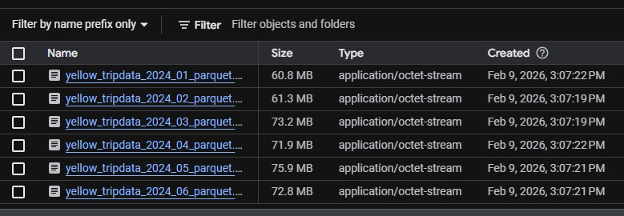
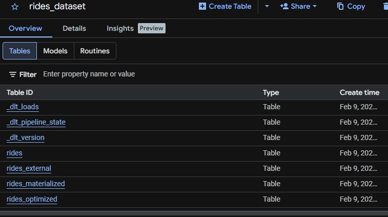
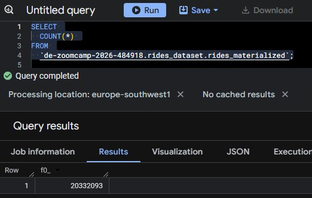
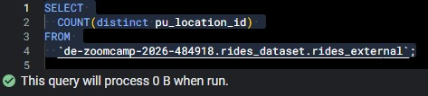
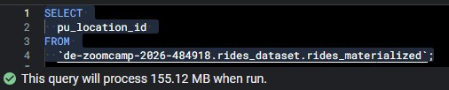
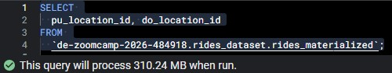
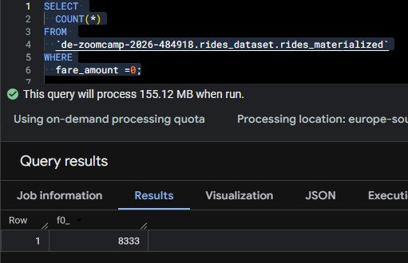
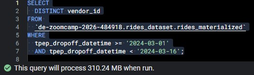
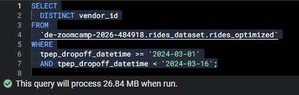
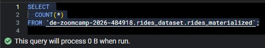

# Module 3 Homework: Data Warehousing & BigQuery

## Loading the data
Make sure that all 6 files show in your GCS bucket before beginning.

<p align="center">
  
</p>

## BigQuery Setup
Create an external table using the Yellow Taxi Trip Records.<br>
Create a (regular/materialized) table in BQ using the Yellow Taxi Trip Records (do not partition or cluster this table).

<p align="center">
  
</p>


## Question 1. Counting records. 
What is count of records for the 2024 Yellow Taxi Data?

```sql
SELECT 
  COUNT(*) 
FROM 
  `de-zoomcamp-2026-484918.rides_dataset.rides_materialized`;
```
<p align="center">
  
</p>


##  Question 2. Data read estimation
Write a query to count the distinct number of PULocationIDs for the entire dataset on both the tables. <br>
What is the estimated amount of data that will be read when this query is executed on the External Table and the Table?

```sql
SELECT 
  COUNT(distinct pu_location_id) 
FROM 
  `de-zoomcamp-2026-484918.rides_dataset.rides_external`;
```
<p align="center">
  
</p>

```sql
SELECT 
  COUNT(distinct pu_location_id) 
FROM 
  `de-zoomcamp-2026-484918.rides_dataset.rides_materialized`;
```
<p align="center">
  
</p>


##  Question 3. Understanding columnar storage
Write a query to retrieve the PULocationID from the table (not the external table) in BigQuery. Now write a query to retrieve the PULocationID and DOLocationID on the same table.
Why are the estimated number of Bytes different?

```sql
SELECT 
  pu_location_id 
FROM 
  `de-zoomcamp-2026-484918.rides_dataset.rides_materialized`;
```
<p align="center">
  
</p>

```sql
SELECT 
  pu_location_id, do_location_id
FROM 
  `de-zoomcamp-2026-484918.rides_dataset.rides_materialized`;
```
<p align="center">
  
</p>

BigQuery is a columnar database, and it only scans the specific columns requested in the query. Querying two columns (PULocationID, DOLocationID) requires reading more data than querying one column (PULocationID), leading to a higher estimated number of bytes processed.


##  Question 4. Counting zero fare trips
How many records have a fare_amount of 0?

```sql
SELECT 
  pu_location_id, do_location_id
FROM 
  `de-zoomcamp-2026-484918.rides_dataset.rides_materialized`;
```
<p align="center">
  
</p>


##  Question 5. Partitioning and clustering
What is the best strategy to make an optimized table in Big Query if your query will always filter based on tpep_dropoff_datetime and order the results by VendorID (Create a new table with this strategy)<br>
Partition by tpep_dropoff_datetime and Cluster on VendorID

```sql
CREATE OR REPLACE TABLE 
  `de-zoomcamp-2026-484918.rides_dataset.rides_optimized`
PARTITION BY 
  DATE(tpep_dropoff_datetime)
CLUSTER BY 
  vendor_id AS
SELECT *
FROM 
  `de-zoomcamp-2026-484918.rides_dataset.rides_materialized`;
```


##  Question 6. Partition benefits
Write a query to retrieve the distinct VendorIDs between tpep_dropoff_datetime 2024-03-01 and 2024-03-15 (inclusive)<br>
Use the materialized table you created earlier in your from clause and note the estimated bytes. Now change the table in the from clause to the partitioned table you created for question 5 and note the estimated bytes processed. What are these values?

```sql
SELECT
  DISTINCT vendor_id
FROM 
  `de-zoomcamp-2026-484918.rides_dataset.rides_materialized`
WHERE
  tpep_dropoff_datetime >= '2024-03-01'
  AND tpep_dropoff_datetime < '2024-03-16';
```
<p align="center">
  
</p>

```sql
SELECT
  DISTINCT vendor_id
FROM 
  `de-zoomcamp-2026-484918.rides_dataset.rides_optimized`
WHERE
  tpep_dropoff_datetime >= '2024-03-01'
  AND tpep_dropoff_datetime < '2024-03-16';
```
<p align="center">
  
</p>


##  Question 7. External table storage
Where is the data stored in the External Table you created?<br>
GCP Bucket


##  Question 8. Clustering best practices
It is best practice in Big Query to always cluster your data:<br>
False.<br>
Partitioning and clustering only when your query patterns justifies it.


##  Question 9. Understanding table scans
Write a `SELECT count(*)` query FROM the materialized table you created. How many bytes does it estimate will be read? Why? <br>

This query will process 0 B when run.
Because when running a COUNT(*) over a materialized (native) table on bigquery it retrieves the data from the metadata and doesn't need to scan the table.

```sql
SELECT 
  COUNT(*)
FROM `de-zoomcamp-2026-484918.rides_dataset.rides_materialized`;
```
<p align="center">
  
</p>
