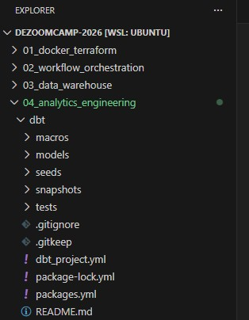
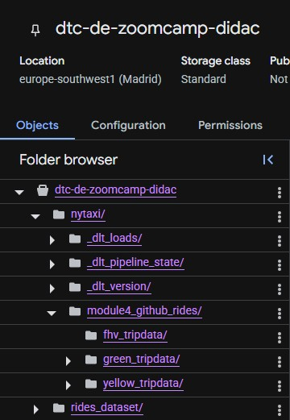
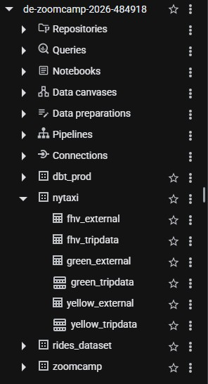
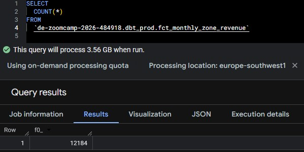
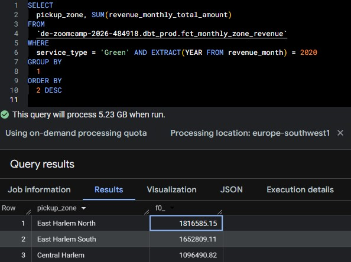
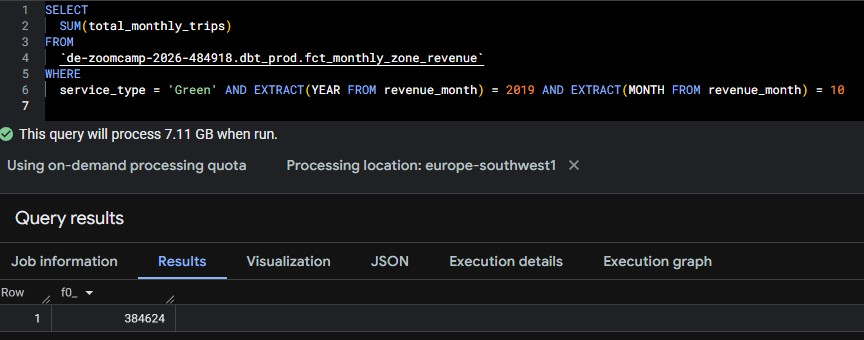
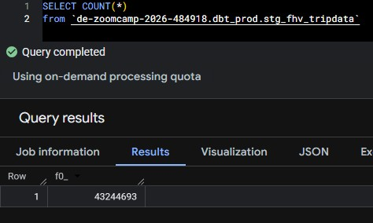

# Module 4 Homework: Analytics Engineering with dbt

## Setup: Loading the data
1.Set up your dbt project following the setup guide

<p align="center">
  
</p>

2.Load the Green and Yellow taxi data for 2019-2020 into your warehouse.
Data in GCS.
<p align="center">
  
</p>

Tables in BigQuery.
<p align="center">
  
</p>


## Question 1. dbt Lineage and Execution
Given a dbt project with the following structure:
models/
├── staging/
│   ├── stg_green_tripdata.sql
│   └── stg_yellow_tripdata.sql
└── intermediate/
    └── int_trips_unioned.sql (depends on stg_green_tripdata & stg_yellow_tripdata)

If you run dbt run --select int_trips_unioned, what models will be built?

int_trips_unioned only

Because "--select" without the + operator selects only the specified model and does not include upstream or downstream dependencies.

## Question 2. dbt Tests
You've configured a generic test like this in your schema.yml:
```yml
columns:
  - name: payment_type
    data_tests:
      - accepted_values:
          arguments:
            values: [1, 2, 3, 4, 5]
            quote: false
```
Your model fct_trips has been running successfully for months. A new value 6 now appears in the source data.

What happens when you run dbt test --select fct_trips?

dbt will fail the test, returning a non-zero exit code

Because when the test runs it will return at least one row for the new value (6) and for that reason the test will fail.


## Question 3. Counting Records in fct_monthly_zone_revenue
After running your dbt project, query the fct_monthly_zone_revenue model.

What is the count of records in the fct_monthly_zone_revenue model?

```sql
SELECT 
  COUNT(*)
FROM
  `de-zoomcamp-2026-484918.dbt_prod.fct_monthly_zone_revenue`
```
<p align="center">
  
</p>


## Question 4. Best Performing Zone for Green Taxis (2020)
Using the fct_monthly_zone_revenue table, find the pickup zone with the highest total revenue (revenue_monthly_total_amount) for Green taxi trips in 2020.

Which zone had the highest revenue?

```sql
SELECT 
  pickup_zone, SUM(revenue_monthly_total_amount)
FROM
  `de-zoomcamp-2026-484918.dbt_prod.fct_monthly_zone_revenue`
WHERE
  service_type = 'Green' AND EXTRACT(YEAR FROM revenue_month) = 2020
GROUP BY
  1
ORDER BY
  2 DESC
```
<p align="center">
  
</p>


## Question 5. Green Taxi Trip Counts (October 2019)
Using the fct_monthly_zone_revenue table, what is the total number of trips (total_monthly_trips) for Green taxis in October 2019?

```sql
SELECT 
  SUM(total_monthly_trips)
FROM
  `de-zoomcamp-2026-484918.dbt_prod.fct_monthly_zone_revenue`
WHERE
  service_type = 'Green' AND EXTRACT(YEAR FROM revenue_month) = 2019 AND EXTRACT(MONTH FROM revenue_month) = 10
```
<p align="center">
  
</p>


## Question 6. Build a Staging Model for FHV Data
Create a staging model for the For-Hire Vehicle (FHV) trip data for 2019.

What is the count of records in stg_fhv_tripdata?

```sql
SELECT COUNT(*)
from `de-zoomcamp-2026-484918.dbt_prod.stg_fhv_tripdata`
```
<p align="center">
  
</p>