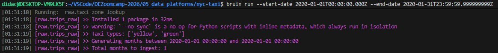
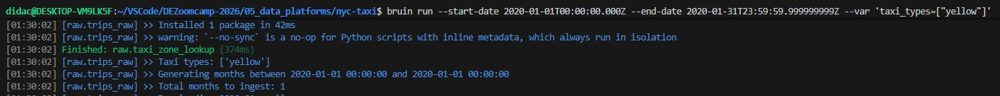
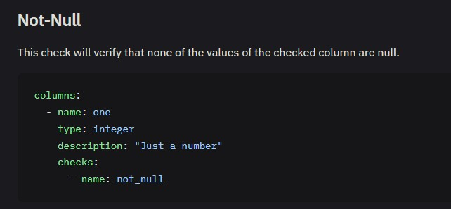
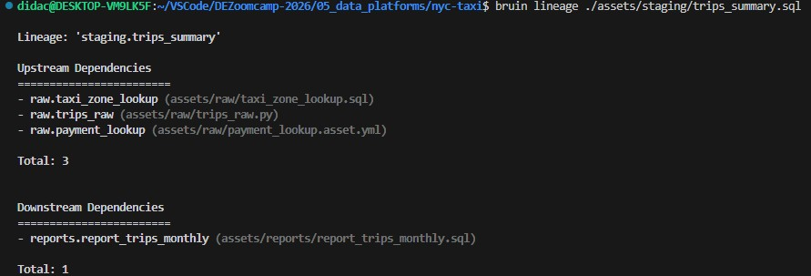
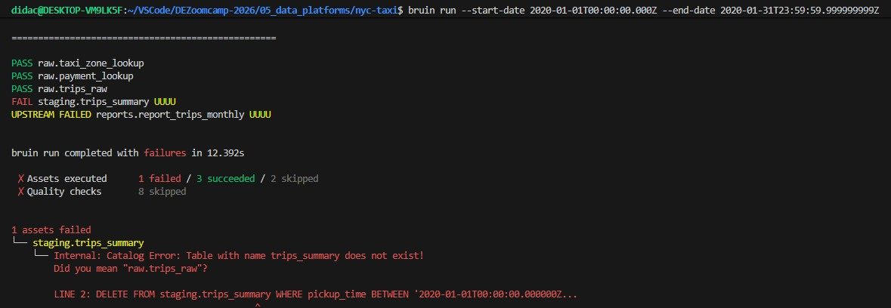
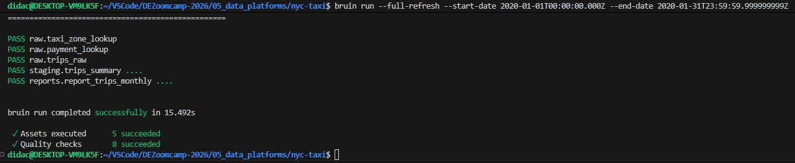

# Module 5 Homework: Data Platforms with Bruin

## Question 1. Bruin Pipeline Structure
In a Bruin project, what are the required files/directories?

.bruin.yml and pipeline/ with pipeline.yml and assets/

<p align="center">
  
</p>


## Question 2. Materialization Strategies
You're building a pipeline that processes NYC taxi data organized by month based on pickup_datetime. Which incremental strategy is best for processing a specific interval period by deleting and inserting data for that time period?

time_interval - incremental based on a time column

Append only adds new rows. Replace truncates de whole table so it's not incremental. A view doesn't have anything to do whith processing data.

<p align="center">
  
</p>


## Question 3. Pipeline Variables
You have the following variable defined in pipeline.yml:

```yaml
variables:
  taxi_types:
    type: array
    items:
      type: string
    default: ["yellow", "green"]
```

How do you override this when running the pipeline to only process yellow taxis?

bruin run --var 'taxi_types=["yellow"]'

Without overriding the variable value:
<p align="left">
  
</p>
Overriding variable value:
<p align="left">
  
</p>

## Question 4. Running with Dependencies
You've modified the ingestion/trips.py asset and want to run it plus all downstream assets. Which command should you use?

bruin run ingestion/trips.py --downstream
<p align="center">
  
</p>

## Question 5. Quality Checks
You want to ensure the pickup_datetime column in your trips table never has NULL values. Which quality check should you add to your asset definition?

name: not_null
<p align="center">
  
</p>

## Question 6. Lineage and Dependencies
After building your pipeline, you want to visualize the dependency graph between assets. Which Bruin command should you use?

bruin lineage
<p align="center">
  
</p>


## Question 7. First-Time Run
You're running a Bruin pipeline for the first time on a new DuckDB database. What flag should you use to ensure tables are created from scratch?

--full-refresh

When running a Bruin pipeline for the first time on a new DuckDB database without the --full-refresh flag:
```bash
bruin run --start-date 2020-01-01T00:00:00.000Z --end-date 2020-01-31T23:59:59.999999999Z
```
Resulted on:
<p align="center">
  
</p>


While with --full-refresh tag included:
```bash
bruin run --full-refresh --start-date 2020-01-01T00:00:00.000Z --end-date 2020-01-31T23:59:59.999999999Z
```
Resulted on:
<p align="center">
  
</p>
