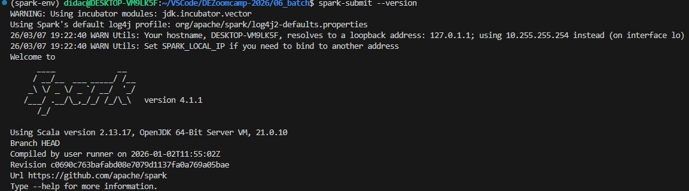
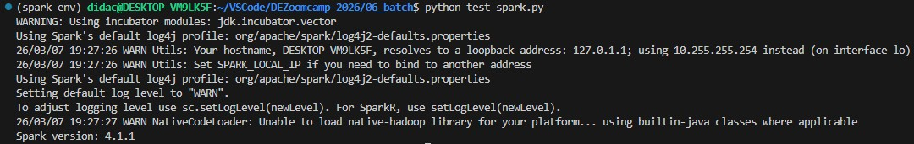
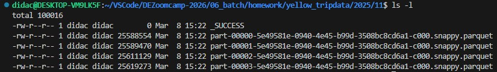
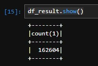
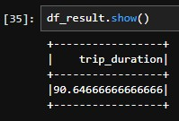
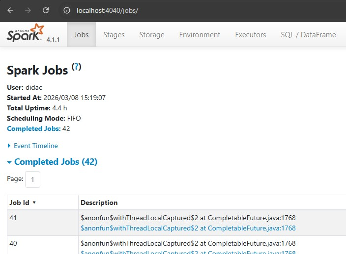
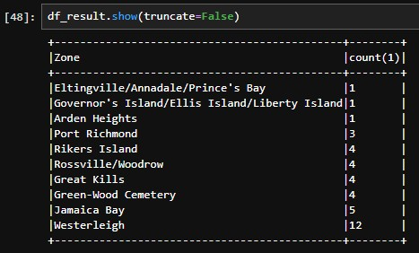

# Module 6 Homework: Batch

## Question 1: Install Spark and PySpark
Install Spark
Run PySpark
Create a local spark session
Execute spark.version.

What's the output?

```python
spark-submit --version
```
<p align="center">
  
</p>

```python
python test_spark.py
```
<p align="center">
  
</p>


## Question 2: Yellow November 2025
Read the November 2025 Yellow into a Spark Dataframe.
Repartition the Dataframe to 4 partitions and save it to parquet.
What is the average size of the Parquet (ending with .parquet extension) Files that were created (in MB)? Select the answer which most closely matches.

```python
import pandas as pd
import pyspark
from pyspark.sql import SparkSession

spark = SparkSession.builder \
    .master("local[*]") \
    .appName('homework') \
    .config("spark.driver.memory", "4g") \
    .getOrCreate()

df = spark.read \
    .option("header", "true") \
    .parquet('yellow_tripdata_2025-11.parquet')

df = df.repartition(4)

df.write.mode("overwrite").parquet("yellow_tripdata/2025/11/")
```

<p align="center">
  
</p>


## Question 3: Count records
How many taxi trips were there on the 15th of November?
Consider only trips that started on the 15th of November.

```python
df.createOrReplaceTempView ('yellow_tripdata')

df_result = spark.sql("""
SELECT 
    count(*)
FROM
    yellow_tripdata
WHERE
    DATE(tpep_pickup_datetime) = '2025-11-15'
""")

df_result.show()
```

<p align="center">
  
</p>

## Question 4: Longest trip
What is the length of the longest trip in the dataset in hours?

```python
df_result = spark.sql("""
SELECT 
    DATEDIFF(second, tpep_pickup_datetime, tpep_dropoff_datetime) / 3600 AS trip_duration
FROM
    yellow_tripdata
ORDER BY 
    1 DESC
LIMIT 1
""")

df_result.show()
```

<p align="center">
  
</p>

## Question 5: User Interface
Spark's User Interface which shows the application's dashboard runs on which local port?

<p align="center">
  
</p>

## Question 6: Least frequent pickup location zone
Load the zone lookup data into a temp view in Spark:
Using the zone lookup data and the Yellow November 2025 data, what is the name of the LEAST frequent pickup location Zone?


```python
!wget https://d37ci6vzurychx.cloudfront.net/misc/taxi_zone_lookup.csv

df_lookup_zones = spark.read \
    .option("header", "true") \
    .csv('taxi_zone_lookup.csv')

df_lookup_zones.createOrReplaceTempView ('lookup_zones')

df_result = spark.sql("""
SELECT 
    lz.Zone, count(*)
FROM
    yellow_tripdata y INNER JOIN lookup_zones lz ON y.PULocationID=lz.LocationID
GROUP BY
    1
ORDER BY
    2 ASC
LIMIT 10
""")

df_result.show(truncate=False)
```

<p align="center">
  
</p>