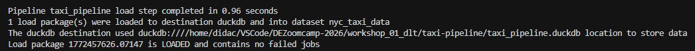
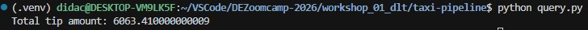

# Workshop DLT Homework: Build Your Own dlt Pipeline

## Run your pipeline and iterate with the agent until it works:

<p align="center">
  
</p>


## Question 1: What is the start date and end date of the dataset?
Using dlt Dashboard:

```bash
dlt pipeline taxi_pipeline show
```

<p align="center">
  
</p>


## Question 2: What proportion of trips are paid with credit card?
Using Marimo Notebook:

```bash
marimo edit taxi_payment_methods_app.py
```
<p align="center">
  
</p>


## Question 3: What is the total amount of money generated in tips?
Using dlt MCP Server to request the agent to create a Python script to retrieve results from the duckdb database:

<p align="center">
  
</p>